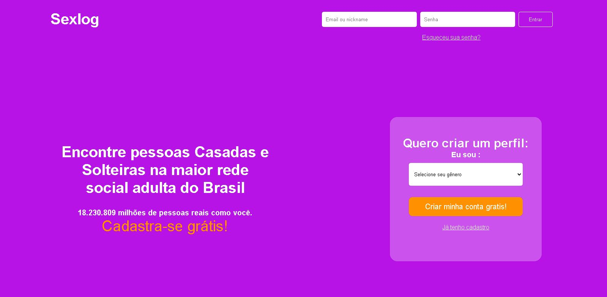

<h1 align="center"> Sex log Fake</h1>

Página fake do site sex log   

  <a href="#-tecnologias">Tecnologias</a>&nbsp;&nbsp;&nbsp;|&nbsp;&nbsp;&nbsp;
  <a href="#-projeto">Projeto</a>&nbsp;&nbsp;&nbsp;|&nbsp;&nbsp;&nbsp;
  <a href="#-layout">Layout</a>&nbsp;&nbsp;&nbsp;|&nbsp;&nbsp;&nbsp;
  <a href="#memo-licença">Licença</a>

  

 

  

## 🚀 Tecnologias

Esse projeto foi desenvolvido com as seguintes tecnologias:

- HTML
- CSS

## 💻 Projeto

Projeto em andamento , clone do site sex log 

- [Visite o projeto online](https://filipeaizen.github.io/copia-sex-log/)
## 🔖 Layout

## :memo: Licença

Esse projeto está sob a licença MIT.

---

Feito com ♥ by Filipe Aizen 